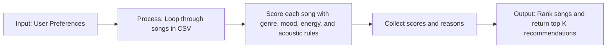

# 🎵 Music Recommender Simulation

## Project Summary

In this project you will build and explain a small music recommender system.

Your goal is to:

- Represent songs and a user "taste profile" as data
- Design a scoring rule that turns that data into recommendations
- Evaluate what your system gets right and wrong
- Reflect on how this mirrors real world AI recommenders

This project simulates a small music recommender and explains how modern streaming platforms make recommendations. Real services like Spotify and YouTube often use two main strategies: collaborative filtering, which looks at what similar users listened to or liked, and content-based filtering, which looks at the traits of songs themselves, such as genre, mood, tempo, or energy. In this system, I focus on the content-based side by scoring songs based on a user’s taste profile, while also reflecting the broader idea behind how large platforms combine many signals to predict what a listener may enjoy next.

---

## How The System Works

This recommender works in plain language by comparing a user’s preferred song features to the features of other songs in the catalog. In real-world systems, recommendations are often built from many signals at once, including what similar users liked, what a listener has played before, and the musical traits of the songs themselves. In this simulation, I will prioritize a simple content-based approach, focusing on the song qualities that best suggest a listener’s preferred vibe, such as genre, mood, energy, and other audio-style features.

The idea is similar to how real streaming systems think about recommendations:

- Collaborative filtering uses other users’ behavior. If many people who liked Song A also liked Song B, the system may recommend Song B to someone who likes Song A.
- Content-based filtering uses song attributes. If a user likes calm, upbeat, pop songs, the system may recommend other songs with similar features.
- Hybrid systems combine both approaches. This usually gives better results because collaborative filtering can uncover hidden patterns, while content-based filtering works well even for new songs or users.

A simple way to think about it is: collaborative filtering says “people like you also liked this,” while content-based filtering says “this song has the same qualities as the songs you already enjoy.”

### Planned recommendation approach

For this project, I will use a content-based recommender that scores each song against a specific user profile. The planned profile is a listener who prefers pop, happy songs, and a high-energy vibe, while also preferring songs that are not overly acoustic. The system will loop through every song in the CSV, score it using a weighted recipe, and return the top $k$ results.

### Algorithm Recipe

The finalized scoring logic will use a simple weighted recipe:

- +2.0 points for a genre match
- +1.0 point for a mood match
- +energy similarity points based on how close the song's energy is to the target energy
- a small bonus for acoustic preference when the user likes acoustic songs

This gives the recommender a balance between direct style matches and overall vibe matching. The design is intentionally simple so it is easy to explain and debug.

### Expected biases

This system may over-prioritize genre and mood while under-valuing songs that are great matches for the user’s energy or overall feel but do not share the same label. In a larger system, that kind of bias could make recommendations feel repetitive or too narrow.

### Features used in this simulation

- Song features: genre, mood, energy, tempo, valence, danceability, acousticness
- UserProfile features: favorite genre, favorite mood, target energy level, and whether the user prefers acoustic songs

---

## Getting Started

### Setup

1. Create a virtual environment (optional but recommended):

   ```bash
   python -m venv .venv
   source .venv/bin/activate      # Mac or Linux
   .venv\Scripts\activate         # Windows

2. Install dependencies

```bash
pip install -r requirements.txt
```

3. Run the app:

```bash
python -m src.main
```

### Running Tests

Run the starter tests with:

```bash
pytest
```

You can add more tests in `tests/test_recommender.py`.

---

## Sample Recommendation Output

```text
Loading songs from data/songs.csv...
Loaded songs: 18

Top recommendations:

1. Sunrise City
   Score: 4.13
   Why: This song fits because it genre match (+2.0); mood match (+1.0); energy similarity (0.93); lower acousticness.

2. Gym Hero
   Score: 3.02
   Why: This song fits because it genre match (+2.0); energy similarity (0.82); lower acousticness.

3. Rooftop Lights
   Score: 1.99
   Why: This song fits because it mood match (+1.0); energy similarity (0.99).

4. Night Drive Loop
   Score: 1.20
   Why: This song fits because it energy similarity (1.00); lower acousticness.

5. City Sparks
   Score: 1.11
   Why: This song fits because it energy similarity (0.91); lower acousticness.
```

**Screenshot or video** *(optional)*: <!-- Insert a screenshot or demo video link here -->

---

## Algorithm Recipe

The recommendation logic uses a simple content-based recipe:

- +2.0 points for a genre match
- +1.0 point for a mood match
- +energy similarity points based on how close the song's energy is to the target energy
- a small bonus for acoustic preference when the user likes acoustic songs

This creates a balanced ranking that favors songs that match both the user's preferred style and the energy level they want to hear.

## Data Flow Sketch



## Experiments You Tried

Use this section to document the experiments you ran. For example:

- What happened when you changed the weight on genre from 2.0 to 0.5
- What happened when you added tempo or valence to the score
- How did your system behave for different types of users

---

## Limitations and Risks

Summarize some limitations of your recommender.

Examples:

- It only works on a tiny catalog
- It does not understand lyrics or language
- It might over favor one genre or mood

You will go deeper on this in your model card.

---

## Reflection

Read and complete `model_card.md`:

[**Model Card**](model_card.md)

Write 1 to 2 paragraphs here about what you learned:

- about how recommenders turn data into predictions
- about where bias or unfairness could show up in systems like this


